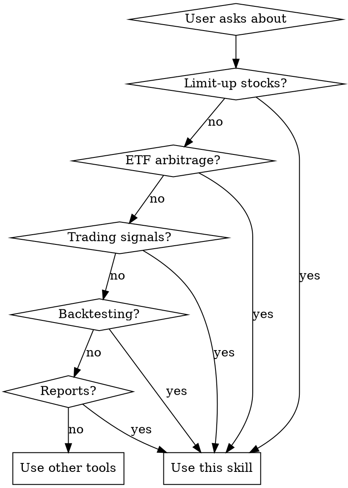

# ETF Arbitrage Assistant

## Overview

智能ETF套利助手，用于分析A股涨停股票与相关ETF之间的套利机会。当股票涨停无法直接买入时，通过购买持仓该股票的ETF来获取收益。

## When to Use



**Trigger symptoms:**
- Questions about 涨停股, 套利, ETF, arbitrage opportunities
- Requests for trading signals or recommendations
- Backtesting strategy performance
- Generating investment reports
- Analyzing stock-ETF relationships

**When NOT to use:**
- General stock market analysis (not ETF arbitrage)
- Technical analysis of individual stocks
- Portfolio management (not arbitrage-focused)

## Core Concepts

**Limit-Up Mechanism (涨停机制):**
- Main board: 10% daily limit
- STAR/ChiNext: 20% daily limit
- When stock hits limit-up, cannot buy directly
- **Arbitrage opportunity**: Buy ETF that holds the stock

**Weight Threshold (权重阈值):**
- Minimum 5% stock weight in ETF for valid signal
- Higher weight = stronger arbitrage effect
- Key filter: `strategy.min_weight = 0.05`

**Signal Confidence (信号置信度):**
- High: Limit-up confirmed + high weight + good liquidity
- Medium: Limit-up expected + medium weight
- Low: Risk factors present (low liquidity, near close)

## Workflows

### Workflow 1: Daily Arbitrage Scan (每日套利扫描)


**Steps:**
1. Check limit-up status: `GET /api/limit-up` or use MCP tool `etf_arbitrage_list_limit_up_stocks`
2. For each limit-up stock, find related ETFs using `etf_arbitrage_find_related_etfs`
3. Evaluate arbitrage potential:
   - ETF liquidity (daily amount > 50M)
   - Premium rate (avoid high premium)
   - Time to market close (>30 min preferred)
4. Rank by: weight × liquidity × time_factor
5. Return top 3-5 opportunities

### Workflow 2: Signal Quality Assessment (信号质量评估)


**Key Metrics:**
- Signal success rate: `profitable_signals / total_signals`
- Average return per signal
- Time decay: signals closer to close perform worse
- Liquidity filter effectiveness

### Workflow 3: Backtest Analysis (回测分析)


**Parameters to define:**
- Date range: `start_date`, `end_date`
- Strategy: `highest_weight` / `balanced` / `best_liquidity`
- Weight threshold: `min_weight` (default 0.05)
- Signal filters: time filter, liquidity filter

## Quick Reference

| User Query | Action | MCP Tool / API |
|------------|--------|-----------------|
| "今天涨停股" | List limit-up stocks | `etf_arbitrage_list_limit_up_stocks` |
| "XX股票相关ETF" | Find related ETFs | `etf_arbitrage_find_related_etfs` |
| "分析套利机会" | Analyze opportunity | `etf_arbitrage_analyze_opportunity` |
| "历史信号" | List signals | `etf_arbitrage_list_signals` |
| "运行回测" | Run backtest | `etf_arbitrage_run_backtest` |
| "回测结果" | Get backtest result | `etf_arbitrage_get_backtest_result` |

## Response Format

**For arbitrage opportunities, structure response as:**

```markdown
# 今日套利机会

## 🔴 涨停股票
| 股票代码 | 股票名称 | 涨幅 | 时间 |
|---------|---------|------|------|

## 📊 相关ETF (按权重排序)
### 推荐度: ⭐⭐⭐
- **ETF名称** (代码)
  - 权重: X.XX%
  - 流动性: XXX亿
  - 溢价率: +X.XX%
  - 推荐理由: [理由]

### 推荐度: ⭐⭐
...
```

**For backtest reports:**
```markdown
# 回测分析报告

## 策略参数
- 时间范围: YYYY-MM-DD ~ YYYY-MM-DD
- 策略: XXX
- 最小权重: XX%

## 核心指标
| 指标 | 数值 |
|------|------|
| 总信号数 | XX |
| 成功率 | XX% |
| 平均收益 | XX% |
| 最大回撤 | XX% |
```

## Common Mistakes

| Mistake | Fix |
|---------|-----|
| Ignoring liquidity check | Always check ETF daily amount > 50M |
| Not considering premium rate | Avoid ETFs with premium > 2% |
| Forgetting time to close | Signals < 30min to close are weaker |
| Missing weight threshold | Only recommend ETFs with weight >= 5% |

## API Endpoints Reference

**Market Data:**
- `GET /api/limit-up` - Today's limit-up stocks
- `GET /api/stocks?codes=XXX` - Stock quotes
- `GET /api/stocks/{code}/related-etfs` - Related ETFs

**Signals:**
- `GET /api/signals` - All signals
- `GET /api/signals/{id}` - Signal detail

**Backtest:**
- `POST /api/backtest/start` - Start backtest
- `GET /api/backtest/{id}` - Get results
- `GET /api/backtest` - List backtests

**My Stocks:**
- `GET /api/my-stocks` - List watchlist
- `POST /api/my-stocks/add` - Add stock
- `DELETE /api/my-stocks/{code}` - Remove stock
